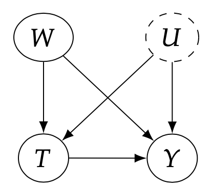
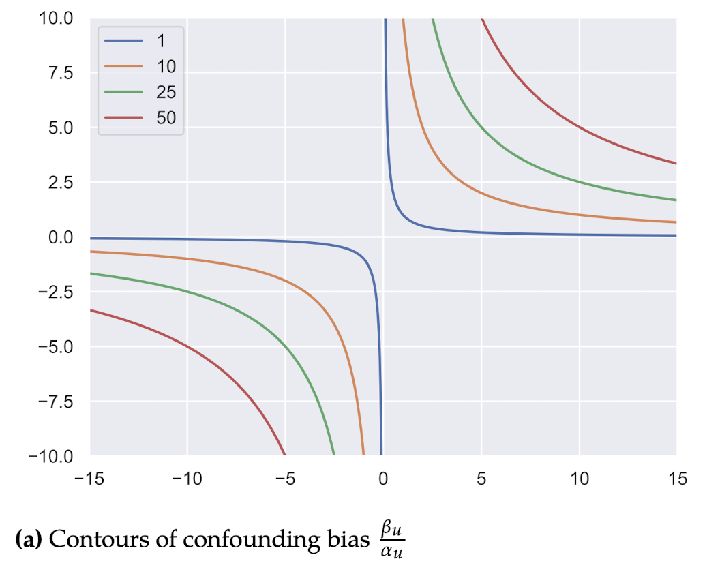
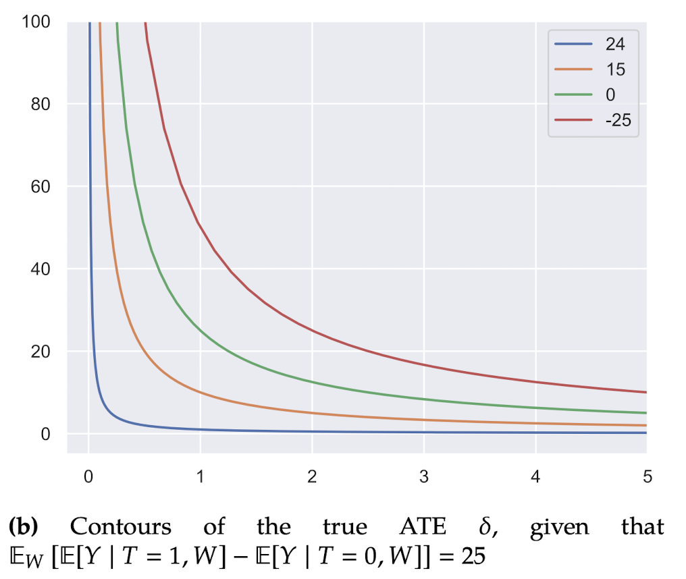

# Packages

```{r}
library(dagitty)
library(tidyverse)
library(psychTools)
library(bnlearn)
library(skimr)
```

# Bounds

-   관측 데이터로 인과추론을 하는 전략은 관측되지 않은 교란 요인이 없다는 검증할 수 없는 가정 하에서 관측된 공변량을 조정하는 것

-   일반적으로 이러한 가정은 만족될 수 없음

-   따라서 관찰되지 않은 교란 요인이 없다는 기본 가정이 위반되었을 때, 인과 추론에 미치는 영향을 정량적으로 볼 수 있어야 함

**신뢰성 체감의 법칙(The law of decreasing credibility)**

-   "추론의 신뢰성은 가정의 강도에 따라 감소한다"

-   즉, 가정이 약할수록 얻어지는 결론이 제한적일 수는 있지만 좀 더 신뢰할 수 있음

**Example**

```{r}
g <- dagitty('dag {
    T [pos="0,1"]
    W [pos="1,0"]
    Y [pos="2,1"]

    W -> T 
    W -> Y
}')

plot(g)
```

$$
E[Y(1) - Y(0)] = E_W[E[Y|T=1,W] - E[Y|T=0,W]]
$$

-   Unconfoundness 가정 하에, 위에 식에서 나오는 결과는 **점**임

```{r}
g <- dagitty('dag {
    W [pos="0,0"]
    T [pos="0,1"]
    Y [pos="1,1"]
    U [pos="1,0"]

    W -> T 
    W -> Y
    U -> T
    U -> Y
    T -> Y
}')

plot(g)
```

$$
\begin{align}
E[Y(1) - Y(0)] &= E_{W, U}[E[Y|T=1,W, U] - E[Y|T=0,W, U]] \\ 
&\approx^?  E_W[E[Y|T=1, W] - E[Y|T=0, W]]
\end{align}
$$

-   관찰되지 않은 교란변수이 있을 경우, 위의 가정을 완화해서 관찰되지 않은 교란변수의 효과에 대한 구간을 식별할 수 있음

## No-Assumption Bound

-   $Y(0)$(처치를 받지 않았을 때의 잠재적 결과), $Y(1)$(처치를 받았을 때의 잠재적 결과)는 $0 \sim 1$의 값을 갖음

**ITE 범위** $$
\begin{align}
-1 \le Y_i(1) - Y_i(0) \le 1, \quad if \quad 0 \le Y(t) \le 1
\end{align}
$$

-   따라서 **ATE**의 length는 **ITE**와 마찬가지로 $2$임

-   **ATE**는 어떠한 가정 없이 length를 절반으로 줄일 수 있다는 것이 알려져 있음

### Assumption 8.1 (Bounded Potential Outcomes)

$$
\begin{align}
\forall t \quad a \le Y(t) \le b
\end{align}
$$

Bounded Potential Outcomes 가정 하에 **ITE**, **ATE**는 다음과 같이 표현될 수 있음

$$
\begin{align}
&a - b \le Y_i(1) - Y_i(0) \le b - a \\
&a - b \le E[ Y(1) - Y(0)] \le b - a
\end{align}
$$ 따라서, 구간의 length는 $2(b-a)$임

**ATE**의 구간의 length는 어떠한 가정 없이 절반으로 줄일 수 있음

**Law of total expectation**

$$
\begin{align}
E[X] = \sum_y P_Y(y) \cdot E[X|Y=y]
\end{align}
$$ 을 이용하면,

$$
\begin{align}
&Y(1), Y(0) : \text{처치를 했을 때와 안했을 때의 가상의 결과} \\
\newline
&E[Y(1)] = \sum_t P_T(t) \cdot E[Y(1)|T=t] = P(T=1) \cdot E[Y(1)|T=1] + P(T=0) \cdot E[Y(1)|T=0]
\end{align}
$$ 로 표현할 수 있고, 아래와 같이 **ATE**를 구할 수 있음

$$
\begin{align}
E[Y(1) - Y(0)] &= E[Y(1)] - E[Y(0)] \\
&=P(T=1) \cdot E[Y(1)|T=1] + P(T=0) \cdot E[Y(1)|T=0] \\
&-P(T=1)E[Y(0)|T=1] - P(T=0)E[Y(0)|T=0] \\ 
\newline 
&=P(T=1) \cdot E[Y|T=1] + P(T=0) \cdot E[Y(1)|T=0] \\
&-P(T=1)E[Y(0)|T=1] - P(T=0)E[Y|T=0]
\end{align}
$$

### Observational-Counterfactual Decomposition

**ATE**에 대해, $P(T=1)$을 \pi로 표현한 식을 `Observational-Counterfactual Decomposition`로 정의함

$$
\begin{align}
E[Y(1) - Y(0)] = \pi \cdot E[Y|T=1] + (1 - \pi) \cdot E[Y(1)|T=0] \\
-\pi \cdot E[Y(0)|T=1] - (1 - \pi) \cdot E[Y|T=0]
\end{align}
$$

### No-Assumption Bound

$E[Y(1)|T=0], \, E[Y(0)|T=1]$는 counterfactual이고, 나머지는 주어진 값이므로 **ATE**의 범위는 다음과 같이 정의될 수 있음


`No-Assumption Bound`의 length를 구해보면

$$
\begin{align}
&\pi \cdot E[Y|T=1] + (1 - \pi) \cdot b -\pi \cdot a - (1 - \pi) \cdot E[Y|T=0] \\
&-(\pi \cdot E[Y|T=1] + (1 - \pi) \cdot a -\pi \cdot b - (1 - \pi) \cdot E[Y|T=0]) \\
&= (1-\pi)b + \pi b - \pi a - (1 - \pi) a \\ 
&= b - a
\end{align}
$$

$b-a$로 length가 절반으로 줄어드는 것을 볼 수 있음(즉, 어떠한 가정 없이 구간이 절반으로 줄어듦)

`No-Assumption Bound`의 경우 구간에 $0$이 포함되므로 causal effect가 있는지 없는지 판단할 수 없음

따라서, 추가적인 가정 하에 구간의 length를 줄여서 $0$을 포함하도록 만들어줘야 함

아래 절차는 합리적인 가정을 추가했을 때, 구간의 length를 줄이는 과정을 의미함

## Monotone Treatment Response

### Assumption 8.2 (Nonnegative Monotone Treatment Response)


모든 **ITE**가 nonnegative라는 가정 하에 Lower Bound를 구해보면 다음과 같음

### Nonnegative MTR Lower Bound


$E[Y(1) | T = 0] \geq E[Y(0) | T =0] = E[Y|T=0]$

$-E[Y(0) | T = 1] \geq -E[Y(1) | T = 1] = E[Y|T=1]$

$$
\begin{align}
E[Y(1) - Y(0)] = &\pi \cdot E[Y|T=1] + (1 - \pi) \cdot E[Y(1) | T = 0] -\pi \cdot E[Y(0) | Y=1 ] - (1 - \pi) \cdot E[Y|T=0] \\
&\geq \pi \cdot E[Y|T=1] + (1 - \pi) \cdot E[Y | T = 0] -\pi \cdot E[Y | Y=1 ] - (1 - \pi) \cdot E[Y|T=0] \\
&=0
\end{align}
$$

### Assumption 8.3 (Nonpositive Monotone Treatment Response)


## Monotone Treatment Selection

가정 : treatment 그룹의 potential outcome이 non-treatment 그룹의 potential outcome에 비해 좋아야함


## Optimal Treatment Selection


# Sensitive Analysis

-   관측 데이터로 인과추론을 하는 전략은 관측되지 않은 교란 요인이 없다는 검증할 수 없는 가정 하에서 관측된 공변량을 조정하는 것
-   일반적으로 이러한 가정은 만족될 수 없음
-   따라서 관찰되지 않은 교란 요인이 없다는 가정이 위반되었을 때, 인과 추론에 미치는 영향을 정량적으로 확인할 수 있어야 함
-   이는 민감도 분석을 통해 할 수 있음

### Sensitivity Basiscs in Linear Setting

-   관찰되지 않은 교란요인 $U$가 존재할 때, $W$에 대해서만 조정할 경우 생기는 편향은 무엇일까?
-   그림(b)에 대해 noise가 없는 선형 구조방정식을 가정하면 다음과 같이 표현할 수 있음

{width="50%"}

$$
\begin{align*}
&T := \alpha_w W + \alpha_u U \\
&Y := \beta_w W + \beta_u U + \delta T \\
\end{align*}
$$

$$
E[Y(1) - Y(0)] = E_{W, U}[E[Y|T=1,W,U] - E[Y|T=0, W, U]] = \delta
$$

-   $U$는 unobserved confounder이므로, $W$만 조정할 수 있음

```{block, type='rmdcomment'}
$T$, $Y$에 대해 $W$에 대해 조정할 경우, $U$의 영향으로 confounding bias가 $\frac{\beta_u}{\alpha_u}$만큼 발생함
```

$$
E_W[E[Y|T=1, W]-E[Y|T=0, W]] - E_{W,U}[E[Y|T=1, W, U] - E[Y|T=0, W, U]] = \frac{\beta_u}{\alpha_u}
$$

$proof$

$$
\begin{align*}
E_W[E[Y|T=t, W]] &= E_W[E[\beta_w W + \beta_u U + \delta T|T=t, W]] \\ 
&= E_W[\beta_w W + \beta_u E[U|T=t, W] + \delta t] \\
\newline 
&=E_w \left[\beta_w W + \beta_u \frac{t-\alpha_w W}{\alpha_u} + \delta t\right] \\
&=E_w \left[\beta_w W + \frac{\beta_u}{\alpha_u}t - \frac{\beta_u \alpha_w}{\alpha_u}W + \delta t\right] \\
&=\beta_w E[W] + \frac{\beta_u}{\alpha_u}t - \frac{\beta_u \alpha_w}{\alpha_u}E[W] + \delta t \\
&=\left(\delta + \frac{\beta_u}{\alpha_u}\right)t + \left(\beta_w - \frac{\beta_u \alpha_w}{\alpha_u}\right)E[W] 
\end{align*}
$$

$$
\begin{align*}
&E_W[E[Y|T=1, W]-E[Y|T=0, W]] \\ 
&= \left(\delta + \frac{\beta_u}{\alpha_u}\right)(1) + \left(\beta_w - \frac{\beta_u \alpha_w}{\alpha_u}\right)E[W] - \left[\left(\delta + \frac{\beta_u}{\alpha_u}\right)(0) + \left(\beta_w - \frac{\beta_u \alpha_w}{\alpha_u}\right)E[W]\right] \\
&= \delta + \frac{\beta_u}{\alpha_u}
\end{align*}
$$

$$
\begin{align*}
Bias &= E_W[E[Y|T=1, W]-E[Y|T=0, W]]  \\
&- E_{W,U}[E[Y|T=1, W, U] - E[Y|T=0, W, U]] \\
&= \delta + \frac{\beta_u}{\alpha_u} - \delta \\
&= \frac{\beta_u}{\alpha_u} 
\end{align*}
$$

### Sensitivity Contour Plots

-   $Y$에 대한 $T$의 causal effect를 나타내는 ATE는 $\delta$이므로, 위의 식을 $\delta$에 대해서 정리하면 다음과 같음

$$
E_W[E[Y|T=1, W]-E[Y|T=0, W]] = \delta + \frac{\beta_u}{\alpha_u}
$$

$$
\begin{align*}
\delta = E_W[E[Y|T=1, W]-E[Y|T=0, W]] - \frac{\beta_u}{\alpha_u}
\end{align*}
$$



-   (a)의 경우 ($\frac{1}{\alpha_u}$, $\beta_u$)에 대한 plot에 해당하고, 색에 따른 값은 $Bias$에 해당함



-   $E_W[E[Y|T=1, W]-E[Y|T=0, W]]=25$일 때, ($\frac{1}{\alpha_u}$, $\beta_u$)에 따른 $\delta$의 변화 그래프
-   $\delta = E_{W, U}[E[Y|T=1,W,U] - E[Y|T=0, W, U]] = 25 -\frac{\beta_u}{\alpha_u}$
-   관찰된 인과 관계를 설명하는데 얼마나 강력한 관찰되지 않은 교란 요인 $U$가 필요한지에 대해 확인해볼 수 있음
-   green curve일 경우 $\delta = 0$ 이므로, 관찰되지 않은 교란 요인 $U$에 의해 $E_W[E[Y|T=1, W]-E[Y|T=0, W]]$을 전부 설명한다는 의미이므로, $U$의 효과가 매우 크다고 볼 수 있음

### More General Settings

-   $T, \, U$에 대한 가정에 따라 민감도 분석을 다양한 형태로 확장할 수 있음

1.  **Assess-ing Sensitivity to an Unobserved Binary Covariate in an Observational Study with Binary Outcome(1983)**

-   이전 linear setting과 달리 $T$ 가 실제 값이 아니라, $T = 1$일 확률에 대해 표현할 수 있음

$$
P(T=1 | W, U) := \frac{1}{1+\exp(-(\alpha_w W + \alpha_u U))}, \quad U:0, 1
$$

2.  **Making sense of sensitivity: extending omitted variable bias(2020)**

-   해당 논문에서는 회귀모형에서 관찰되지 않은 교란 요인 $U$의 효과를 다양한 형태로 확장함
    -   $T$에 대한 함수 형태를 가정 x
    -   $U$에 대한 분포 가정 x
    -   관찰되지 않은 교란 요인 $U$의 효과에 대한 **robustness value** 도입
    -   극단적인 시나리오(교란요인의 상호작용 효과, 비선형 효과 포함)에 대해 해당 결과가 얼마나 강건한지에 대한 지표, **partial** $R^2$ 도입
-   해당 논문에 대한 내용은 R `sensemakr` 패키지에 구현되어 있음
    -   튜토리얼 : <https://cran.r-project.org/web/packages/sensemakr/vignettes/sensemakr.html>
    -   튜토리얼 데이터에 대한 기사 : **Angry or Weary? The effect of personal violence on attitudes towards peace in Darfur**
        -   dafur 난민이 전쟁에 노출되었을 때, 평화에 대한 개인의 태도에 미치는 영향에 대한 인과분석을 수행함

# 참고 자료

<https://www.youtube.com/watch?v=rbZ4ebZCHMY&list=PLKKkeayRo4PWyV8Gr-RcbWcis26ltIyMN&index=14>

<https://www.youtube.com/watch?v=N-EWlpkisnQ&list=PLliBbGBc5nn2QcZ-5K_S08wJR6kt2EK1R&index=4>

<https://cran.r-project.org/web/packages/sensemakr/vignettes/sensemakr.html>

causalsens: Sensitivity Analysis for Causal Effects
